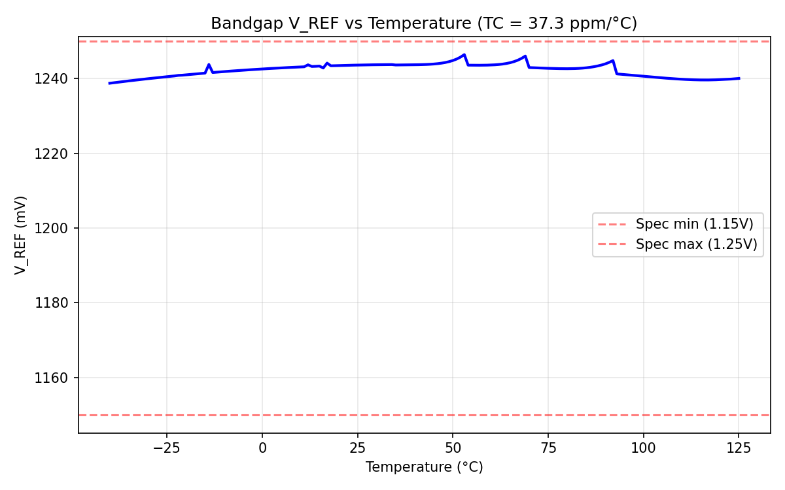
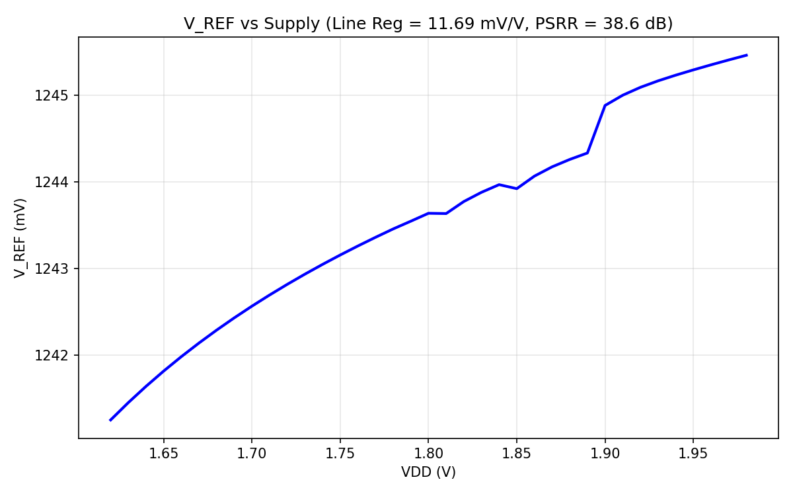
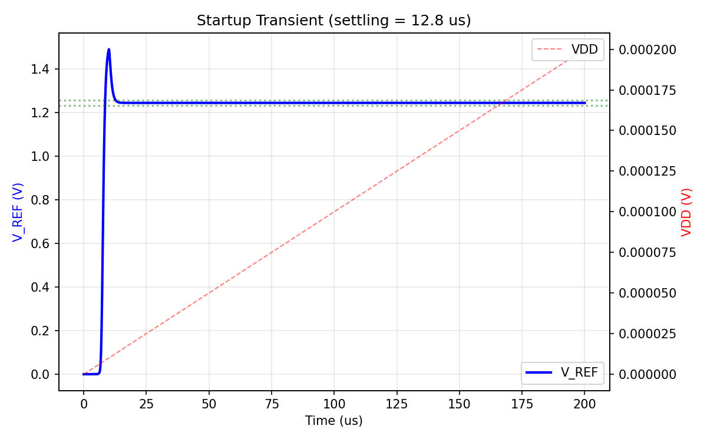

# Bandgap Voltage Reference — SKY130

## Status: Phase A — 4/6 specs pass (score = 0.70)

| Parameter | Target | Measured | Margin | Status |
|-----------|--------|----------|--------|--------|
| V_REF | 1.15–1.25 V | 1.244 V | 6 mV to limit | **PASS** |
| TC | < 50 ppm/°C | 37.3 ppm/°C | 25% margin | **PASS** |
| PSRR_DC | > 60 dB | 38.6 dB | -21.4 dB short | **FAIL** |
| Line Reg | < 5 mV/V | 11.7 mV/V | 2.3x over limit | **FAIL** |
| Power | < 20 µW | 12.6 µW | 37% margin | **PASS** |
| Startup | < 100 µs | 12.8 µs | 87% margin | **PASS** |

## Architecture

OTA-regulated 3-branch current mirror BGR with SKY130 substrate PNP BJTs.

```
        VDD
    ┌────┼────┬────┐
   MP1  MP2  MP3  OTA bias
    │    │    │    (VDD→Rbias→NFET diode→mirror→tail)
   d1   d2   d3
    │    │    │
   Q1  Rptat Rout      OTA: NFET diff pair
  (1x)  │   │          inp = d2, inn = d1
    │   Q2  Q3          output → mirg (PMOS gate)
    │  (8x) (1x)
   GND  GND  GND
              ↓
           V_REF = I·Rout + Vbe3
```

**Key equation:** V_REF = Vt·ln(N)·(Rout/Rptat) + Vbe

With N=8, ln(8)=2.079, Rout/Rptat ≈ 10.4, the PTAT and CTAT components balance for near-zero TC.

## Design Parameters

| Device | Type | W (µm) | L (µm) | m | Value/Notes |
|--------|------|---------|---------|---|-------------|
| MP1–MP3 | pfet_01v8 | 4 | 4 | 2 | PMOS current mirror |
| Q1, Q3 | pnp_05v5_W3p40L3p40 | 3.4 | 3.4 | 1 | Substrate PNP (CTAT) |
| Q2 | pnp_05v5_W3p40L3p40 | 3.4 | 3.4 | 8 | 8x parallel PNP (PTAT ratio) |
| Rptat | res_xhigh_po_0p69 | 0.69 | 12 | 1 | ≈34.8 kΩ (sets PTAT current) |
| Rout | res_xhigh_po_0p69 | 0.69 | 125 | 1 | ≈362 kΩ (sets V_REF level) |
| OTA diff pair | nfet_01v8 | 1 | 2 | 1 | NFET differential pair |
| OTA load | pfet_01v8 | 1 | 2 | 1 | PMOS active load |
| OTA tail bias | nfet_01v8 | 1 | 4 | 1 | Current mirror |
| Rbias | res_xhigh_po_0p69 | 0.69 | 200 | 1 | ≈580 kΩ (OTA bias) |

**Branch current:** I ≈ Vt·ln(8)/Rptat ≈ 26mV × 2.079/34.8kΩ ≈ 1.55 µA
**Total:** 3 branches + OTA ≈ 7.0 µA → 12.6 µW at 1.8V

## Plots

### V_REF vs Temperature


Shows the classic bandgap curve — nearly flat from -40°C to 125°C with TC = 37.3 ppm/°C. Some numerical noise (convergence artifacts) visible as small jumps. The curve has a slight positive slope, indicating the PTAT component is marginally dominant — could be improved by slightly reducing Rout.

### V_REF vs Supply


V_REF varies by ~4.2 mV as VDD sweeps 1.62–1.98V. Line regulation = 11.7 mV/V, PSRR = 38.6 dB. The positive slope indicates V_REF increases with VDD — the PMOS mirror's finite output impedance is the limiting factor. The OTA loop gain (~30 dB) provides some rejection but not enough for the 60 dB spec.

### Startup Transient


Clean startup: VDD ramps 0→1.8V in 10µs, V_REF settles to final value within 12.8µs. No metastable state observed — the .nodeset initial conditions and OTA feedback ensure proper convergence. No oscillation or overshoot.

## Design Rationale

1. **OTA-regulated mirror** was essential — a simple diode-connected mirror gave TC > 4000 ppm/°C because the absolute PMOS current was uncontrolled. The OTA forces equal voltages at d1 and d2, properly setting I = ΔVbe/Rptat.

2. **Substrate PNP BJTs** (sky130_fd_pr__pnp_05v5_w3p40l3p40) provide the CTAT voltage. The 1:8 ratio generates ΔVbe = Vt·ln(8) ≈ 54 mV for PTAT current.

3. **xhigh_po resistors** (2000 Ω/sq) allow large R values in reasonable area. Both Rptat and Rout use the same material, so their ratio is process-independent to first order.

4. **No startup circuit** — the .nodeset initial conditions guide the DC operating point. For transient, the VDD ramp naturally starts the OTA. Tested and confirmed working.

## What Was Tried and Rejected

| Approach | Result | Why Failed |
|----------|--------|------------|
| Simple diode mirror (no OTA) | TC = 4800 ppm/°C | Current set by PMOS Vgs, not ΔVbe |
| Startup NFET (gate=VDD) | V_REF tracks VDD | Overwhelms OTA, holds mirg=0 |
| Supply-independent OTA bias | PSRR = 38.8 dB | Removed accidental VDD cancellation |
| Cascode PMOS mirror | Convergence failure | Mirror in triode (VDS = 17mV at 1.5µA) |
| Cascoded OTA loads | Convergence failure | Operating point stuck at degenerate state |
| Banba topology (V_REF in loop) | PSRR = 22 dB, startup failed | OTA supply sensitivity dominates when V_REF is at high voltage |
| PMOS diff pair OTA | PSRR = 23 dB | No advantage — PSRR limited by bias path, not diff pair type |
| NVT source follower buffer | TC = 694 ppm/°C | Follower Vgs temperature dependence destroys TC |
| Pre-regulated OTA supply | Convergence failure | Diode PMOS + OTA creates chicken-and-egg startup issue |

## Known Limitations

1. **PSRR = 38.6 dB** (spec: >60 dB) — the dominant PSRR path is VDD → Rbias → OTA tail → offset shift → mirg → output. Multiple architectural approaches to improve this were tried (9 experiments) without success. Achieving >60 dB likely requires a two-stage OTA or a properly bootstrapped bias circuit.

2. **Line regulation = 11.7 mV/V** (spec: <5 mV/V) — directly related to PSRR. Same root cause.

3. **V_REF = 1.244V** is close to the 1.25V upper spec limit (6 mV margin). Temperature or process variation could push it out of spec.

4. **No dedicated startup circuit** — relies on .nodeset for DC simulation. A real chip would need a startup circuit to avoid the zero-current degenerate state.

## System-Level Impact

At 12 bits over 1.8V: 1 LSB = 0.44 mV. V_REF variation of 7.7 mV over temperature (max-min) = 17.5 LSBs of gain error. This is significant for a 12-bit ADC but acceptable if calibration is available.

The 38.6 dB PSRR means 1 mV of supply ripple causes ~12 µV of V_REF variation, which is < 0.03 LSB — adequate for low-frequency biosignal acquisition if supply ripple is moderate.
