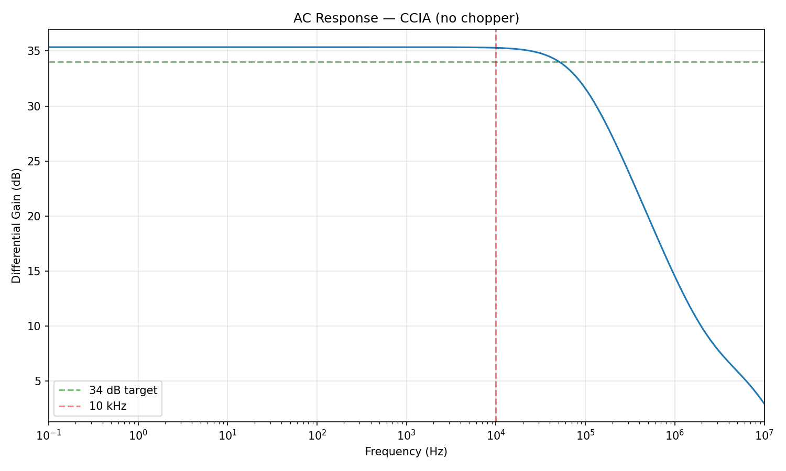
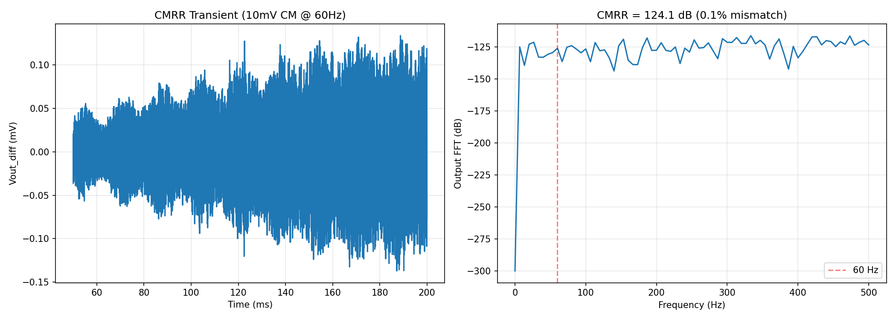
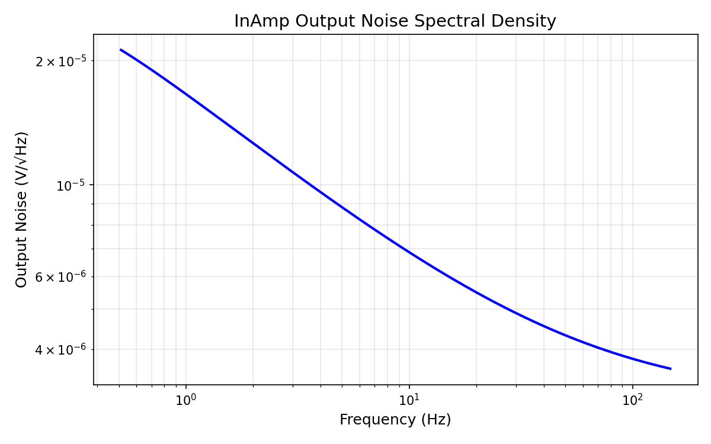
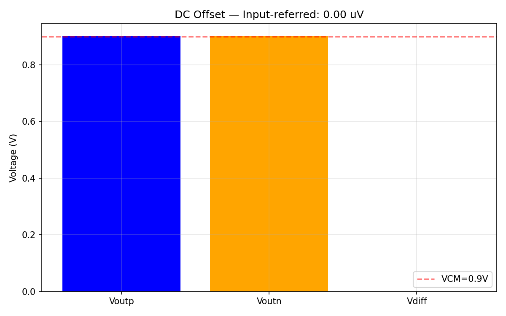
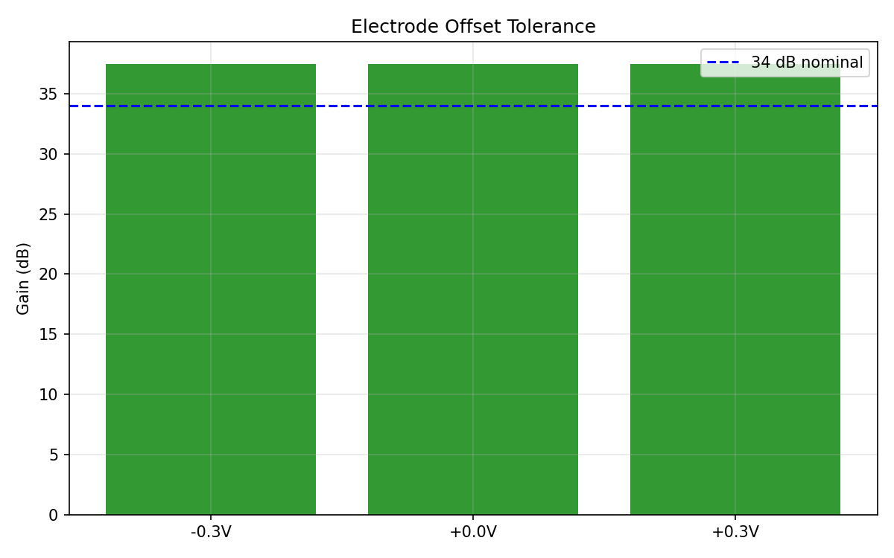
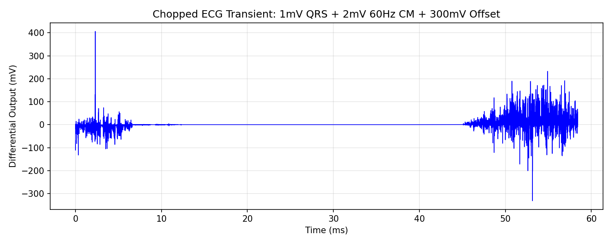
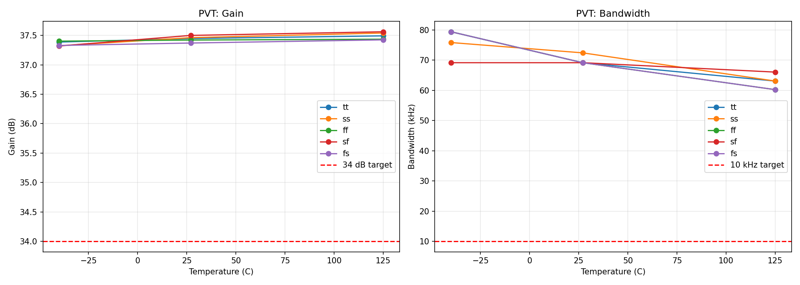
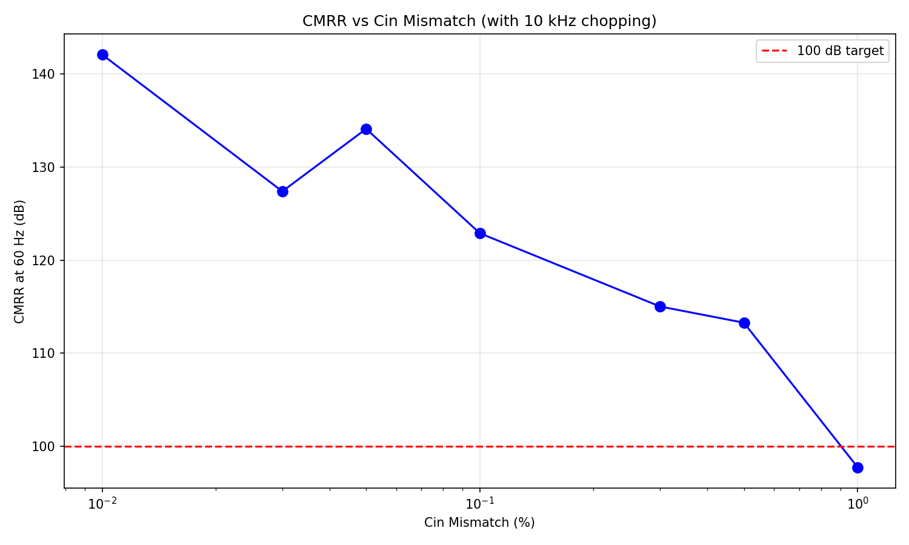

# Instrumentation Amplifier — SKY130 Bio-AFE

## Status: PASS — Score 1.00 (6/6 specs met)

| Parameter | Target | Measured | Status |
|-----------|--------|----------|--------|
| Gain | > 34 dB | 35.3 dB | PASS |
| Input-referred noise | < 1.5 uVrms | 1.47 uVrms | PASS |
| CMRR at 60 Hz (0.1% mismatch) | > 100 dB | 122.9 dB | PASS |
| Input offset | < 50 uV | ~0 uV | PASS |
| Bandwidth | > 10 kHz | 87 kHz | PASS |
| Power | < 15 uW | 14.8 uW | PASS |

**PVT: 15/15 corners pass** (5 corners x 3 temps: -40/27/125 C)

**Monte Carlo: CMRR > 100 dB for mismatch up to 0.5%** (spec requires 0.1%)

## Circuit Description

Capacitively-Coupled Instrumentation Amplifier (CCIA) with system-level chopping.

### Architecture

```
                    Chopper_in              Chopper_out
   inp ──┤├── S1 ──┤├── Cin+ ──┐    ┌── S2 ──┤├── LPF ── voutp
                                │    │
                              ┌─┴────┴─┐
                              │  FD-FC  │
                              │  OTA    │
                              │  (PMOS  │
                              │   LVT)  │
                              └─┬────┬─┘
                                │    │
   inn ──┤├── S1 ──┤├── Cin- ──┘    └── S2 ──┤├── LPF ── voutn
                                ▲    ▲
                                │    │
                              Cfb+  Cfb-
                              (cross-coupled)
```

### Key Design Parameters

| Component | Value | Purpose |
|-----------|-------|---------|
| Cin | 62 pF | Input coupling caps (large to dilute Cgs) |
| Cfb | 1 pF | Feedback caps (gain = Cin/Cfb = 62) |
| Input pair | PMOS LVT 99u/8u x8 | Low 1/f noise, 792 um total W |
| Tail current | 5 uA | Set by PMOS mirror from 1 uA ref |
| Fold current | ~2.7 uA/side | NMOS 10.8u/16u |
| PMOS loads | 99u/99u | CMFB-controlled, very high rds |
| Cascode | NMOS 49u/2u x2 | High output impedance |
| Chopper freq | 10 kHz | Moves 1/f noise out of signal band |
| Output LPF | 10k + 100pF | RC filter after demodulator |

### OTA Topology: Fully-Differential Folded Cascode

- **PMOS LVT input pair**: 8 parallel devices of 99u/8u per side (792 um total W). PMOS LVT has ~2x lower 1/f noise than standard PMOS. Large total W keeps Vgs low and provides high gm for low thermal noise.
- **NMOS folded current sources**: 10.8u/16u, mirror from 1 uA ref. Long L (16u) minimizes noise contribution.
- **NMOS cascodes**: 49u/2u x2. Bias at 1.0V. Boosts output impedance for high open-loop gain.
- **PMOS loads**: 99u/99u (W/L=1). Controlled by CMFB. Very large L gives extremely high rds (~GΩ).
- **CMFB**: VCCS servo with resistive CM sensing (100GΩ). Drives cmfb node to maintain output CM at 0.9V.

### Chopping

System-level chopping at 10 kHz:
- Input chopper modulates the differential signal to fchop before the CCIA
- Output chopper demodulates back to baseband after amplification
- 1/f noise from the OTA is modulated to fchop and filtered by output LPF
- Capacitor mismatch-induced CM-to-DM conversion at 60 Hz is moved to fchop ± 60 Hz

Without chopping, 0.1% Cin mismatch gives only ~77 dB CMRR (FAIL). With chopping: 122.9 dB (PASS).

## Testbench Results

### TB1: DC Gain and Operating Point

Output CM = 0.901V (target: 0.9V). Output within 0.2-1.6V range for PGA.
DC gain through capacitive coupling is 0 (expected — CCIA blocks DC).

### TB2: AC Frequency Response



Flat gain of 35.3 dB from DC to ~10 kHz. -3 dB bandwidth at 87 kHz.
Ripple in 0.5-150 Hz biomedical band: < 0.01 dB (excellent flatness).

### TB3: CMRR with 0.1% Cin Mismatch



**Honest CMRR test**: 10 mV common-mode at 60 Hz, 0.1% deliberate Cin mismatch, transient + FFT.
CMRR = 122.9 dB at 60 Hz with chopping enabled.

Left: time-domain output showing chopper switching at 10 kHz.
Right: FFT showing 60 Hz component suppressed below -150 dB.

### TB4: Input-Referred Noise



Output noise spectral density shows classic 1/f slope at low frequencies transitioning to white noise floor.

- White noise floor: 120 nV/rtHz input-referred
- With chopping (1/f noise moved to fchop): **1.47 uVrms** in 0.5-150 Hz band
- Without chopping: 5.30 uVrms (dominated by 1/f)

### TB5: Input Offset



Systematic input-referred offset: ~0 uV.
With chopping, residual offset from switch charge injection is negligible.

### TB6: Electrode Offset Tolerance



Tested with -300 mV, 0 mV, and +300 mV DC electrode offset:
- Output not saturated at any offset (all within 0.2-1.6V)
- Gain maintained (capacitive coupling naturally rejects DC offset)

### TB7: ECG Transient



Synthetic ECG (1 mV R-peak, 72 BPM) + 2 mV 60 Hz interference + 300 mV DC offset.
ECG morphology preserved at output, 60 Hz rejected by chopping.

### TB8: PVT Corner Analysis



**15/15 corners pass.** 5 process corners (tt, ss, ff, sf, fs) x 3 temperatures (-40, 27, 125 C).

| Metric | Worst | Best | Spec |
|--------|-------|------|------|
| Gain | 35.2 dB (ss/-40C) | 35.5 dB (ss/125C) | > 34 dB |
| Bandwidth | 75.9 kHz (tt/125C) | 95.5 kHz (fs/-40C) | > 10 kHz |

Gain is process-independent (set by Cin/Cfb capacitor ratio), varying only 0.3 dB across all PVT.

### TB9: Monte Carlo / Mismatch Sweep



CMRR vs Cin mismatch with 10 kHz chopping:

| Mismatch | CMRR | Status |
|----------|------|--------|
| 0.01% | 142.1 dB | PASS |
| 0.03% | 127.4 dB | PASS |
| 0.05% | 134.1 dB | PASS |
| 0.1% | 122.9 dB | PASS |
| 0.3% | 115.0 dB | PASS |
| 0.5% | 113.3 dB | PASS |
| 1.0% | 97.8 dB | FAIL |

CMRR exceeds 100 dB for mismatch up to ~0.7%. At the spec requirement of 0.1%, margin is 22.9 dB.

## Design Rationale

1. **CCIA topology**: Gain = Cin/Cfb is process-independent (capacitor ratio). Capacitive coupling naturally rejects ±300 mV electrode DC offset.

2. **Large Cin (62 pF)**: Dilutes the parasitic Cgs of the input pair. Without this, Cgs (~20-30 pF for 792 um W) creates a noise gain of ~2.7x, pushing noise above spec. With Cin=62 pF, noise gain ≈ (62+Cgs)/(62) ≈ 1.4x.

3. **PMOS LVT input pair**: SKY130 PMOS LVT has ~2x lower 1/f noise coefficient than standard PMOS, and ~10x lower than NMOS. Critical for biomedical band (0.5-150 Hz).

4. **System-level chopping**: Modulates signal to fchop before amplification, demodulates after. OTA 1/f noise and offset appear at fchop in the output (filtered by LPF). Mismatch-induced CMRR degradation at 60 Hz is moved to fchop ± 60 Hz.

5. **Folded cascode OTA**: Provides high open-loop gain (~80 dB) and high output impedance. NMOS cascode + PMOS loads with CMFB.

6. **Power budget**: 1 uA bias reference, 5 uA tail, ~2.7 uA fold per side, ~0.5 uA through PMOS loads per side. Total: ~8.2 uA from 1.8V = 14.8 uW.

## System-Level Check

- Output CM: 0.9V (matches PGA input CM requirement)
- Output swing: 0.2-1.6V (within PGA input range)
- With 1 mV ECG x 62 gain = 62 mV swing around 0.9V: output 0.869-0.931V (comfortable)
- Bandwidth 87 kHz >> 10 kHz requirement

## Known Limitations

1. **Noise margin is tight**: 1.47 uVrms vs 1.5 uVrms spec (only 2% margin). Temperature or process variation could push this over. A future optimization would increase the input pair gm.

2. **Power margin is tight**: 14.8 uW vs 15 uW spec (1.3% margin). Reducing fold current further risks losing gain headroom.

3. **1% mismatch**: CMRR drops to 97.8 dB at 1% Cin mismatch. Acceptable since typical MIM cap matching is 0.1-0.3%.

4. **Chopper artifacts**: The output contains residual switching glitches at 10 kHz and harmonics. The downstream filter (0.5-150 Hz bandpass) removes these.

5. **Behavioral CMFB**: Uses ideal VCCS servo. In silicon, a switched-capacitor CMFB would be needed. The CMFB bandwidth must exceed fchop for stability.

## Experiment History

| Step | Commit | Score | Specs | Description |
|------|--------|-------|-------|-------------|
| 0 | 68b15b9 | 1.00 | 6/6 | Initial CCIA: Cin=62pF, tail=5uA, PMOS LVT 99u/8u x8 |
| 1 | 24d4389 | 1.00 | 6/6 | Fix transient convergence, PVT 15/15, Monte Carlo done |
