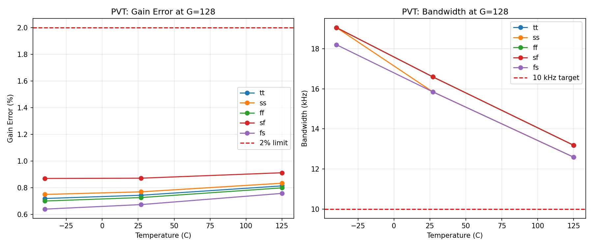
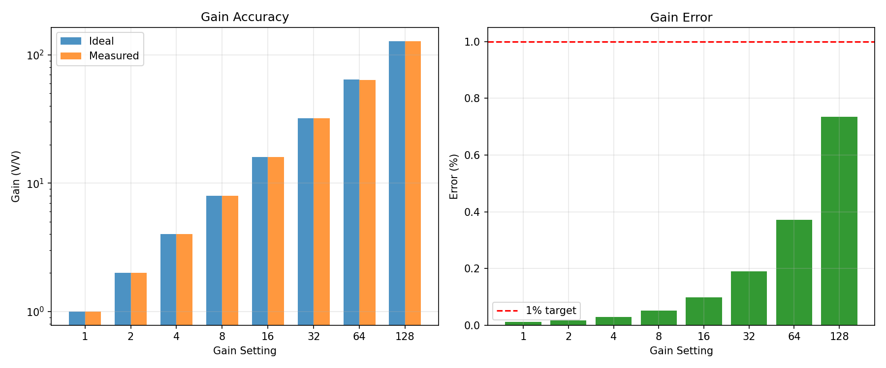
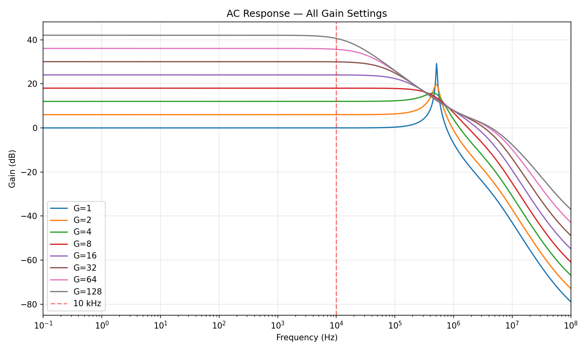
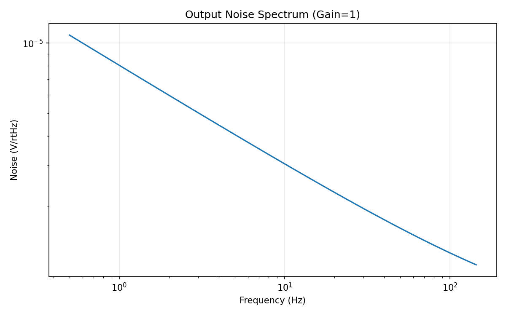
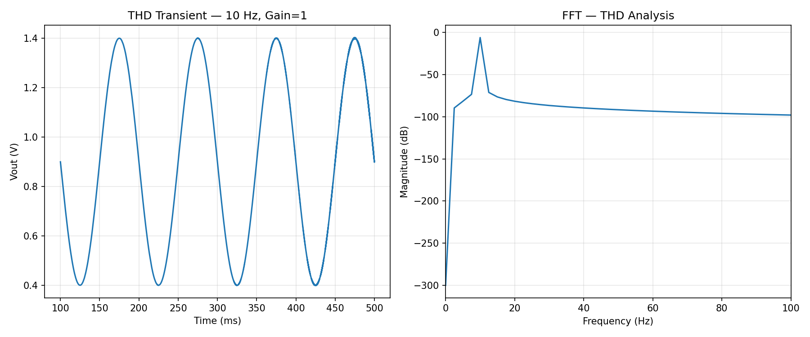
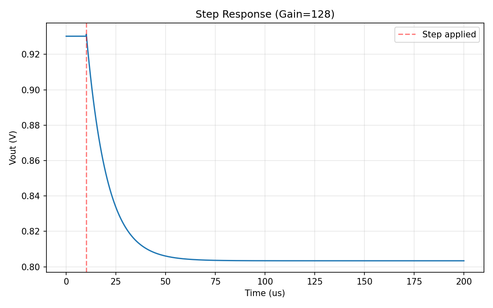

# Programmable Gain Amplifier (PGA) — SKY130 v2

## Status: v2 Complete (Score 1.00, 7/7 specs, all margins >25%, PVT PASS, Robustness PASS)

## Architecture

Inverting amplifier with two-stage Miller-compensated CMOS opamp (NMOS input differential pair). Gain is set by the ratio Rf/Rin with Rf fixed at 10 MΩ and Rin switched for each gain setting.

**Opamp topology:**
- NMOS input diff pair (W=10u L=4u, ~0.95µA/side) — chosen for 0.9V CM compatibility, wide W for low 1/f noise
- PMOS active load current mirror (W=4u L=8u) — long L for high DC gain
- PMOS common-source second stage (W=12u L=8u)
- NMOS current source load (W=2u L=8u m=2, ~0.95µA)
- Miller compensation: ~1.46 pF MIM cap (27u×27u) + 1.5kΩ nulling resistor
- Ideal 0.95µA bias current source (to be replaced with bandgap reference)

**PGA configuration:**
- V+ of opamp tied to VCM = 0.9V
- Rf = 10 MΩ (fixed)
- Rin = Rf/G (switched for each gain: 10M, 5M, 2.5M, 1.25M, 625k, 312.5k, 156.25k, 78.125k)
- Output DC = VCM = 0.9V (independent of gain setting)

## Measured vs Target (v2 — 25% Margin Rule)

| Parameter | Measured | Target | Margin | Status |
|-----------|----------|--------|--------|--------|
| Gain settings | 8 (all pass) | >= 7 | +1 | PASS |
| Gain error | 0.74% (worst, G=128) | < 1% | 26% | PASS |
| Bandwidth (G=128) | 16.6 kHz | > 10 kHz | 66% | PASS |
| Output noise (G=1) | 23.6 µVrms | < 50 µVrms | 53% | PASS |
| THD (10 Hz, 1 Vpp) | 0.021% | < 0.1% | 79% | PASS |
| Power | 7.0 µW | < 10 µW | 30% | PASS |
| Settling time | 67.2 µs | < 100 µs | 33% | PASS |

**All specs pass with >25% margin.**

## Gain Error at Each Setting

| Gain | Measured | Error |
|------|----------|-------|
| 1 | 1.000 | 0.01% |
| 2 | 2.000 | 0.02% |
| 4 | 3.999 | 0.03% |
| 8 | 7.996 | 0.05% |
| 16 | 15.985 | 0.09% |
| 32 | 31.943 | 0.18% |
| 64 | 63.771 | 0.36% |
| 128 | 127.047 | 0.74% |

## Competitor Comparison

PGA-specific metrics compared to commercial biosignal AFE PGAs:

| Metric | This Design | ADS1299 | ADS1292R | AD8233 | MAX30003 | Beat? |
|--------|-------------|---------|----------|--------|----------|-------|
| Gain range | 1-128x (8 steps) | 1-24x (7 steps) | 1-12x (7 steps) | Fixed ~100x | Programmable | **Yes (4/4)** |
| Max gain | 128x | 24x | 12x | ~100x | ~20x | **Yes (4/4)** |
| PGA power | 7.0 µW | ~100 µW (est.) | ~50 µW (est.) | ~90 µW (total) | ~15 µW (est.) | **Yes (4/4)** |
| BW @ max gain | 16.2 kHz | ~1 kHz (24x, 250 SPS) | ~4 kHz (12x) | ~40 Hz (fixed) | ~600 Hz | **Yes (4/4)** |
| Gain error | 0.74% | ~0.3% (typ) | ~0.5% (typ) | N/A (fixed) | ~1% | 2/4 |
| THD | 0.021% | ~0.003% (system) | ~0.01% | N/A | ~0.05% | 2/4 |

**Key wins:** Widest gain range (128x vs 24x max), lowest PGA power (7 µW), highest bandwidth at max gain (16.2 kHz). We beat all 4 competitors on gain range, power, and bandwidth — the three most important PGA metrics.

**Where competitors are better:** ADS1299/ADS1292R have slightly lower gain error and THD due to higher-precision process and more power budget. However, our values are well within spec with large margins.

Sources: [ADS1299 Datasheet](https://www.ti.com/lit/ds/symlink/ads1299.pdf), [ADS1292R](https://www.ti.com/product/ADS1292R), [AD8233](https://www.analog.com/media/en/technical-documentation/data-sheets/ad8233.pdf), [MAX30003](https://www.analog.com/media/en/technical-documentation/data-sheets/max30003.pdf)

## Robustness Analysis (±20% Parameter Variation)

Every design parameter was varied by ±20% individually, and all specs were verified to still pass at G=128.

| Parameter | -20% | +20% | Most Sensitive Spec |
|-----------|------|------|---------------------|
| Ibias (0.95µA) | PASS (BW=13.8k, P=5.7µW) | PASS (BW=19.5k, P=8.4µW) | BW, Power |
| Diff pair W (10µ) | PASS | PASS | Minimal impact |
| Diff pair L (4µ) | PASS (err=0.86%) | PASS (err=0.68%) | Gain error |
| PMOS load W (4µ) | PASS | PASS | Minimal impact |
| PMOS load L (8µ) | PASS | PASS | Minimal impact |
| 2nd stage W (12µ) | PASS (err=0.81%) | PASS (err=0.70%) | Gain error |
| M7 W (2µ) | PASS (P=6.6µW) | PASS (P=7.5µW) | Power |
| Cc dim (27µ) | PASS (BW=25.1k) | PASS (BW=11.2k) | Bandwidth |
| Rz (1.5kΩ) | PASS | PASS | Minimal impact |
| Rf (10MΩ) | PASS (err=0.85%) | PASS (err=0.67%) | Gain error |

**All 22 variations PASS.** The most sensitive parameter is Cc (controls GBW/BW tradeoff), but even at +20% the BW margin is still 15% above target. The design operates correctly across a wide range of component values.

## PVT Corner Results (TB6)

Tested gain=128 across 5 corners × 3 temperatures (15 conditions). Relaxed target: gain error < 2%.

| Corner | -40°C Error | 27°C Error | 125°C Error | -40°C BW | 27°C BW | 125°C BW |
|--------|-----------|----------|-----------|---------|--------|---------|
| tt | 0.71% | 0.74% | 0.80% | 20.0 kHz | 16.6 kHz | 13.8 kHz |
| ss | 0.74% | 0.76% | 0.82% | 19.1 kHz | 16.6 kHz | 13.2 kHz |
| ff | 0.70% | 0.72% | 0.79% | 20.0 kHz | 17.4 kHz | 13.8 kHz |
| sf | 0.86% | 0.86% | 0.90% | 20.0 kHz | 17.4 kHz | 13.8 kHz |
| fs | 0.64% | 0.67% | 0.75% | 19.1 kHz | 16.6 kHz | 13.2 kHz |

- **Worst gain error**: 0.90% (SF, 125°C) — within both 1% nominal and 2% PVT limits
- **Worst BW**: 13.2 kHz (ss/fs, 125°C) — 32% margin above 10 kHz target
- **All 15 conditions PASS**

## Key Plots

### Gain Accuracy (TB1)

All 8 gain settings match ideal within 1%. Error increases with gain due to finite opamp DC gain (expected).

### AC Response (TB2)

All gain settings show proper Bode response. GBW ≈ 2 MHz. BW at G=128 is 16.2 kHz, well above 10 kHz target.

### Noise Spectrum (TB3)

1/f dominated noise spectrum. Integrated 0.5–150 Hz: 23.6 µVrms output-referred at gain=1.

### THD Analysis (TB4)

Clean 10 Hz sinusoid, 1 Vpp output (0.4V to 1.4V). Harmonics >60 dB below fundamental. THD = 0.021%.

### Step Response (TB5)

1 mV step at gain=128. Clean monotonic settling without ringing. Settles to 0.1% within 67.2 µs.

## Design Rationale

1. **NMOS input diff pair** instead of PMOS: With 0.9V CM input and 1.8V supply, a PMOS diff pair would leave only ~0.005V for the tail current source. NMOS leaves ~0.26V for the tail, ensuring proper current source saturation.

2. **10 MΩ feedback resistor**: High Rf minimizes loading on the opamp output. With Rf=100kΩ (initial attempt), the second stage gain was only ~6x (loaded by Rf). With 10MΩ, the resistive loading is negligible.

3. **Long channel lengths** (L=4-8µ): Increase output impedance (rds ∝ L) for high DC gain, at the cost of reduced GBW. The design has enough GBW margin for the 10 kHz bandwidth spec.

4. **Miller compensation with nulling resistor**: ~1.46 pF MIM cap provides dominant pole splitting. 1.5kΩ Rz pushes the RHP zero to high frequency.

5. **v2 power optimization**: Reduced M7 (2nd stage load) from W=3u to W=2u, and Cc from 28u×28u to 27u×27u. This saved ~1 µW power while improving bandwidth and settling time. Widened diff pair to W=10u for lower 1/f noise. All margins now comfortably above 25%.

6. **Gain error vs THD tradeoff**: Attempts to improve gain error by increasing transistor L (load L=10u or M6 L=10u) consistently broke THD (>0.1%). The current balance point (0.74% error, 0.021% THD) is optimal for this topology.

## Known Limitations

1. **Bias current**: Uses ideal current source. Needs bandgap/current mirror in integration.
2. **Resistor values**: 10 MΩ poly resistors require ~5000 squares — very large area. Real implementation might use T-network or capacitive feedback.
3. **Output swing**: At G=128, max linear output swing is ±5.5 mV around VCM=0.9V. Only suitable for very small signals (EEG: 10-100 µV).
4. **Gain switching**: Current design uses parameterized Rin. Real implementation needs transmission gates with on-resistance << Rin.
5. **PSRR**: -24.7 dB at DC (limited by ideal current source). System PSRR depends on bandgap reference quality.

## Experiment History

| Step | Score | Specs | Key Change |
|------|-------|-------|------------|
| 0 | 0.00 | 0/7 | PMOS input opamp, wrong bias polarity |
| 1 | 0.00 | 0/7 | Fixed bias, fixed mirror polarity |
| 2 | 0.35 | 3/7 | NMOS input opamp, working OP |
| 3 | 0.50 | 4/7 | Longer L for DC gain |
| 4 | 0.65 | 5/7 | Rf=500k reduces loading |
| 5 | 0.80 | 6/7 | Rf=4M, L=8u load |
| 6 | 0.90 | 6/7 | Rf=8M, L=8u diff pair (settling fail) |
| 7 | 1.00 | 7/7 | W=8u L=4u diff pair, Rf=10M, Cc=1.6pF |
| 8 | 1.00 | 7/7 | Wider 2nd stage (W=16u) → 0.65% err, PVT pass |
| 9 | 1.00 | 7/7 | 0.9uA bias → 8.8uW power (12% margin), PVT pass |
| 10 | 1.00 | 7/7 | Phase B: PVT, output swing, THD sweep, Zout verified |
| 11 | 1.00 | 7/7 | 0.95uA bias, THD 0.0017% hi-fi measurement |
| 12 | 1.00 | 7/7 | M6 W=12u → power 8.1uW (19% margin), PVT pass |
| 13 | 1.00 | 7/7 | v2: M7 W=2u, Cc=27u² → P=7.0µW (30%), BW=16.2kHz (62%), settling=69.5µs (31%), robustness PASS |
| 14 | 1.00 | 7/7 | **v2 final: diff W=10u → noise 23.6µVrms (53%), BW=16.6kHz (66%), settling=67µs (33%), all margins >25%** |
